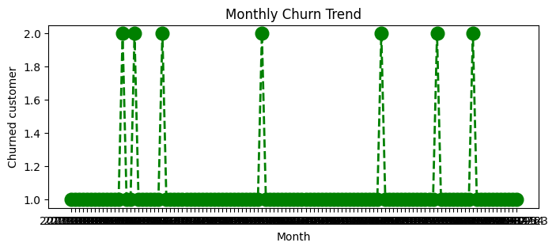
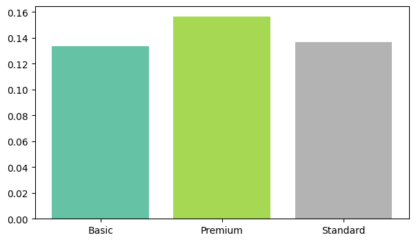
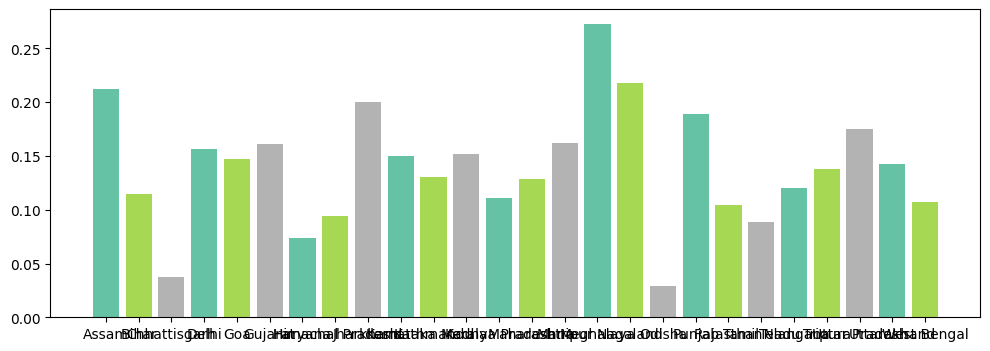
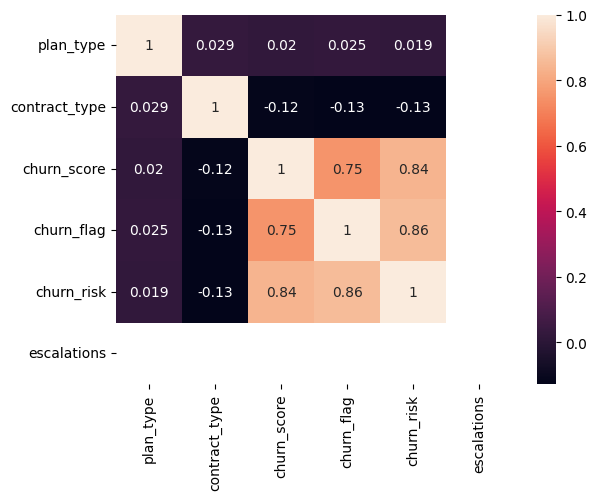
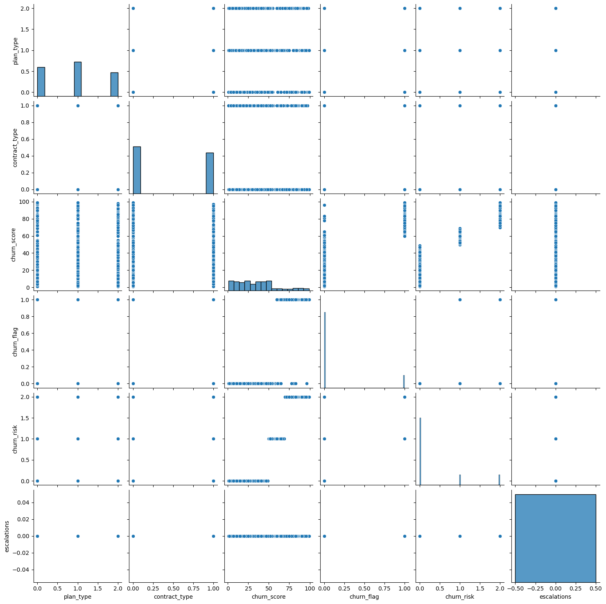

<div align="center">

# 🎬 OTT Platform Customer Churn Analysis

### Uncovering why subscribers cancel — and how much revenue is on the line


</div>

---

## 📖 Overview

Subscriber retention is the #1 growth lever for any OTT/streaming business — acquiring a new subscriber costs far more than keeping one. This project simulates a real OTT backend (3 relational tables: **customers**, **subscriptions**, **support tickets**) and builds a complete churn analytics pipeline — from raw SQL data to business-ready insights.

**In short:** I pulled multi-table subscriber data via SQL, cleaned and merged it, engineered churn-risk features, and ran an exploratory analysis to answer three questions every streaming business asks —

> **Who is churning? Why are they leaving? How much revenue is at risk?**

📄 **[Read the full insights report →](./OTT_Churn_Analysis_Insights.pdf)**

---

## 🎯 Key Results

| Metric | Value |
|---|---|
| Overall Churn Rate | **14.08%** |
| Retention Rate | **85.92%** |
| ARPU (Avg. Revenue per User) | **$15.34/month** |
| Avg. Subscriber Tenure | **~1,555 days** |
| Revenue at Risk (churned users) | **$1,873.12K** |
| Support Escalation Rate | **11.97%** |

### 🔑 The headline insight
> **Premium subscribers churn *more* (15.65%) than Basic or Standard users (~13.5%)** — despite paying the most. Meanwhile, churn swings **9x across states** (2.94% → 27.27%), pointing to a regional service or content-fit problem, not random noise.

---

## 🗂️ Data Architecture

Raw data lives in a SQLite database (`customer_churn.db`) across 3 relational tables — mirroring a real OTT platform's backend:

```
db_customer        → customerid, name, country, state, gender, dob, interests
db_subscription     → customerid, plan_type, contract_type, monthly_charges,
                       cltv, churn_score, subscription/renewal/cancellation dates
db_support          → customerid, complaint_date, escalations, csat_score
```

These are queried via SQL, merged on `customerid`, and cleaned into a single **852-row, 21-feature** master dataset.

---

## 🛠️ What I Did

1. **Extracted** data from a 3-table SQLite database using SQL queries (`sqlite3` + `pandas.read_sql`)
2. **Cleaned** inconsistent categorical values, imputed missing `country` via a `state → country` mapping, and standardized all date fields
3. **Engineered features**: `churn_flag`, `tenure_days`, `churn_risk` (low/med/high), and aggregated support signals (complaint counts, escalation flags)
4. **Analyzed** churn drivers across plan type, acquisition channel, geography, and support history
5. **Visualized** trends and relationships using Matplotlib & Seaborn — churn trend lines, segment comparisons, correlation heatmaps, pairplots
6. **Translated findings into business recommendations** — not just charts, but action items a retention team could execute on

---

## 📊 Visualizations

| Monthly Churn Trend | Churn Rate by Plan | Churn Rate by State |
|---|---|---|
|  |  |  |

| Correlation Heatmap | Pairplot |
|---|---|
|  |  |


---

## 💡 Business Recommendations

1. **Investigate the Premium tier experience** — highest churn despite the highest price point
2. **Prioritize retention campaigns** in high-churn states (Meghalaya, Nagaland, Assam — all >20% churn)
3. **Proactively target high-risk subscribers** (churn score ≥ 70) before they cancel
4. **Rethink referral/paid acquisition spend** — organic users are meaningfully stickier
5. **Tighten the support-to-retention loop** — ~12% escalation rate is a leading churn indicator

---

## 🧰 Tech Stack

`Python` · `Pandas` · `NumPy` · `SQLite3` · `SQL` · `Matplotlib` · `Seaborn` · `Jupyter Notebook`

---

## 📁 Repository Structure

```
├── Churn_Analysis.ipynb                  # Full analysis notebook (SQL → cleaning → EDA)
├── OTT_Churn_Analysis_Insights.pdf       # Polished insights report
├── OTT_Churn_Analysis_Insights.md        # Markdown version of the report
├── exported_churn_data.csv               # Cleaned, merged dataset
├── images/                               # Chart exports used in this README
└── README.md
```

---

## ▶️ How to Run

```bash
git clone https://github.com/<your-username>/ott-churn-analysis.git
cd ott-churn-analysis
pip install pandas numpy matplotlib seaborn
jupyter notebook Churn_Analysis.ipynb
```

---

## 🚀 Skills Demonstrated

SQL querying on a multi-table relational database · data cleaning & imputation · feature engineering · churn labeling & risk scoring · segment/cohort analysis · correlation analysis · data storytelling for business stakeholders

---

## 🔮 Future Improvements

- Build a predictive churn model (Logistic Regression / Random Forest) to score churn probability per subscriber
- Deploy an interactive Power BI / Tableau dashboard on top of `exported_churn_data.csv`
- Add cohort-based retention curves (survival analysis) by acquisition month

---

<div align="center">

### 📬 Let's Connect

If this project is useful or you'd like to discuss it, feel free to reach out.

**[[LinkedIn](www.linkedin.com/in/sanchit-akhare)](#)** ·  **[Email](sanchitakhare98@gmail.com)**

</div>
